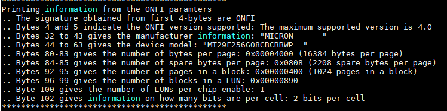
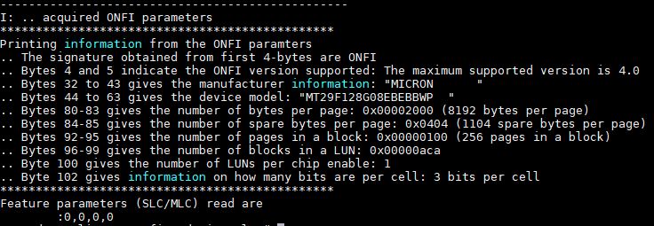

# ONFI NAND Interface

This project details the implementation of interfacing firmware for 3D NAND flash chip. The flash chip used for testing is a product from Micron and is named MT29F256G08CBCBB. This NAND chip is ONFI 4.0 complaint.

Please consult our documentation at [this link](https://sickranchez-c137.github.io/nios_NAND_interface/) for internal details on how each of the functions are implemented.Please also look into the file help.cpp for different application examples. The difference between the linked project and this project is that this project is conditioned to work with Linux machine. Our experiment environment contains DE1-SoC board that runs Linux on ARM machine.

Please go through the codes for the [detail](https://github.com/sickRanchez-c137/onfi_plus) on each implementation. The codes are well commented and are self explanatory.

## Usage Demo
The main function should contain all the basic required function for anyone to get started. Please make sure that all the connections are appropriate as described in *hardware_locations.h*.

### Reading the properties from Memory
Following is the output from the function *read_ONFI_parameters(true)*. The argument *true* indicates the program to print the output received from the memory.

If the compile time flag *PROFILE_TIME* is set to true, all the timing data is recorded into a new file named *time_info_file.txt*. We measure our time using *clock_gettime()* from *time.h*.

One of the first thing we have to do is to erase a block of flash memory. The function *erase_block()* will perform the erase operation. 

### Reading the properties of 3D TLC chip

## Profiling Operations

`Data hidden for confidentiality`

